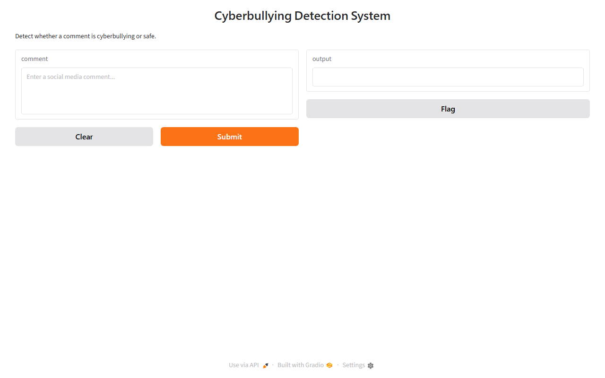

# Cyberbullying Detection (ML)

## Overview

Small machine-learning demo classifying text with TF-IDF and logistic regression, served through a Gradio interface.

## Project Timeline

Development period: Approximately 2026 (source files dated 2026-06; timeline approximate, no Git history).

## Key Features

- TF-IDF text vectorization
- Logistic regression classifier
- Gradio demo UI with sample CSV data

## Technologies

Python, pandas, scikit-learn, Gradio

## Screenshots



## Requirements

Python 3.10 or newer recommended.

## Installation

```
python -m venv venv
venv\Scripts\activate
pip install -r requirements.txt
```

## Running the Application

```
python main.py
```

## Limitations

- Small sample dataset; accuracy is illustrative, not production-grade.
- No model versioning or evaluation harness.

## Future Improvements

- Larger labeled dataset, metrics, and model card.
